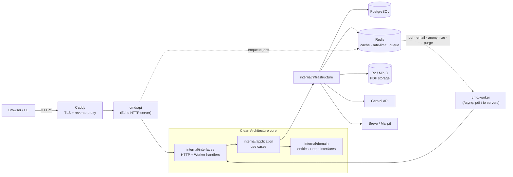
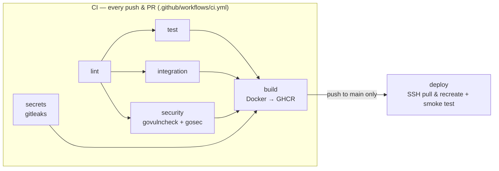
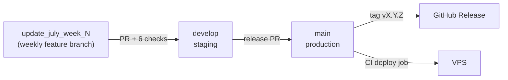

# Controller API — Your Persona's

The backend engine of **Your Persona's** — a Go service that powers an AI-driven psychological assessment platform (MBTI-style + GRIT), orchestrating essay analysis via Gemini API, async PDF generation, and a privacy-first data lifecycle.

---

## Technical Architecture

This service is structured using **Clean Architecture + Domain-Driven Design (DDD)**:

* **Domain** (`internal/domain`): Framework-agnostic core entities (`User`, `TestResult`, `GuestSession`, `DeletionRequest`) and repository interfaces. Imports nothing from GORM/HTTP/SDKs.
* **Application** (`internal/application`): Business workflows (assessment submission + scoring, auth/OTP flows, quota enforcement, referral events, anonymization orchestration).
* **Interfaces** (`internal/interfaces`): Two parallel delivery layers calling the same use cases — HTTP REST handlers (Echo) and Asynq worker handlers.
* **Infrastructure** (`internal/infrastructure`): Third-party adapters — PostgreSQL (GORM), Redis, Cloudflare R2/MinIO, Gemini API, SMTP (Brevo/Mailpit).



---

## Directory Structure

```
controller-api/
├── cmd/
│   ├── api/                 # HTTP server entrypoint + Wire DI config
│   ├── worker/              # Asynq background worker entrypoint
│   ├── migrate/             # GORM AutoMigrate (manual-only, never at boot)
│   └── seed/                # Question bank & insight template seeder (idempotent)
├── docs/                    # Swagger files — swagger.json = official FE contract
├── internal/
│   ├── domain/              # Entities and repository contracts
│   ├── application/         # Use case orchestrators
│   ├── infrastructure/      # Postgres, Redis, R2, Gemini, SMTP, i18n adapters
│   └── interfaces/          # HTTP handlers (Echo) + Worker handlers (Asynq)
├── pkg/                     # Shared utilities (httpresponse, locale, taskqueue, aivalidator)
├── docker/                  # Dockerfile, Dockerfile.dev, compose files, Caddyfile
├── scripts/                 # Ops scripts (DB backup to S3/R2)
├── .github/workflows/       # CI/CD pipeline (7 jobs)
└── Makefile                 # Build and development task runner
```

---

## Setup & Running Locally

### Prerequisites
* Go 1.26+
* Docker & Docker Compose
* `make` tool

### Step 1 — Environment Settings
Copy `.env.example` to `.env` and fill in the necessary fields. In production mode (`APP_ENV=production`), the server enforces strict boot validation — it refuses to start if secrets are still dev defaults or required keys are empty.

Key variables:
* `JWT_SECRET` — token signing key
* `GEMINI_API_KEY` / `GEMINI_MODEL` — model **must** be a pinned version (e.g. `-001`), never an auto-updating alias
* `ALLOWED_ORIGINS` — comma-separated CORS whitelist; `*` is rejected at boot
* `TURNSTILE_SECRET_KEY` — empty in dev = bot-check auto-passes

### Step 2 — Run Service Stack
```bash
make dev    # Postgres, Redis, MinIO, Mailpit + Air hot-reload
```

### Step 3 — Migrate & Seed
```bash
make migrate    # schema migration (never auto-runs — by design)
make seed       # question bank + insight templates
```

Dev tools available at:
* **Swagger UI**: http://localhost:8080/swagger/index.html
* **Mailpit** (email catcher): http://localhost:8025
* **MinIO Console** (S3 storage): http://localhost:9001 (`minioadmin`/`minioadmin`)

---

## Core Operations & Features

### 1. Synchronous AI Assessment Pipeline
* `POST /v1/assessment/submit` calls Gemini **synchronously** (3–8s, by design — the FE "Waiting Room" UX) with role-separated prompts and structural essay framing (prompt-injection mitigations).
* Layered cost protection ("Denial of Wallet"): 32KB payload cap, 4,000-char essay cap, garbage-input filter, per-IP rate limit, Redis distributed quota lock (`quota_lock:<id>`), in-process Gemini semaphore, and a global daily token budget — exhaustion degrades gracefully to a static fallback result, never an error.
* Every Gemini call is audited to `PROMPT_AUDIT_LOG` (30-day TTL, auto-purged).

### 2. Background Jobs (Asynq)
* Two Asynq servers in one worker process: `pdf` queue (CPU-bound, capped concurrency) isolated from io queues (`critical`/`default`/`low`) — a PDF burst can never starve OTP emails.
* Job types: `generate:pdf`, `send:email`, `anonymize:user`, plus scheduled scans (`deletion:scan-expired` hourly, `purge:guest-ttl` + `purge:audit-ttl` daily). All idempotent.

### 3. Auth & Account Security
* JWT with rotation + denylist, `token_version` mass-revocation, account lockout separate from per-IP rate limits, HIBP breach-check on passwords, Cloudflare Turnstile on register/login/forgot-password (fail-open if Cloudflare itself is down), CSRF double-submit on cookie-sensitive endpoints.

### 4. Privacy-First Data Lifecycle
* Account deletion = 14-day grace period → **anonymization** (not hard-delete): PII scrambled, aggregate stats retained, R2 PDFs explicitly deleted.
* Guest results auto-expire after 14 days (R2 object deleted **before** DB row — no orphan files).

---

## CI/CD & Branching





`main` and `develop` are **branch-protected**: no direct pushes, no force-push, no deletion — every change lands via a PR passing all 6 required checks on an up-to-date branch. Releases: PR `develop` → `main`, then SemVer tag + GitHub Release. The `deploy` job no-ops safely until `VPS_SSH_KEY` is configured; **migrations never auto-run on deploy** — see [`docs/deploy_runbook.md`](./docs/deploy_runbook.md).

---

## Testing

```bash
make test                         # unit only — fast, no Docker
go test -tags=integration ./...   # + testcontainers (needs Docker running)
```

* **Domain/application**: unit tests with mockery-generated mocks (checked into git; regenerate via `mockery`). A test needing a real DB in these layers is in the wrong layer.
* **Infrastructure**: Postgres/Redis code uses integration tests (testcontainers-go, behind `//go:build integration`); HTTP clients test against `httptest.Server`; vendor-SDK wrappers are tested on pre-flight logic only.
* **Interfaces**: real use case + mocked lower deps — validates status codes, envelope shape, cookie/header handling. Handler helpers signal an already-written response via the `errResponseWritten` sentinel (`helpers.go`).
* CI runs the full suite **including integration** on every push/PR.

---

## API Contract

`docs/swagger.json` (+ `swagger.yaml`) is the machine-readable contract, generated from handler annotations (`make swag`) and committed to git. The FE builds against this file — not by reading Go source. **Breaking changes to `/v1` go through `/v2`, never silent edits**; additive changes (new optional field/endpoint) are fine.

---

## Makefile Quick Reference

| Command | Description |
|---|---|
| `make dev` | Starts dev environment with Air live-reload (Postgres/Redis/MinIO/Mailpit). |
| `make prod` | Starts production containers (detached). |
| `make stop` / `make prune` | Stops containers / stops + wipes volumes (**DB data lost**). |
| `make migrate` / `make seed` | Applies schema migration / seeds initial data. |
| `make wire` | Regenerates dependency injection (`wire_gen.go`). |
| `make swag` | Regenerates Swagger API documentation. |
| `make test` / `make lint` | Unit tests (race + coverage) / golangci-lint. |
| `make run-api` / `make run-worker` | Runs binaries locally without Docker. |

---

## Documentation

* [`AGENTS.md`](./AGENTS.md) — architecture, security & git-workflow rules (AI agents included)
* [`TECHNICAL_DOCUMENTATION.md`](./TECHNICAL_DOCUMENTATION.md) — API spec, background jobs, testing strategy
* [`docs/deploy_runbook.md`](./docs/deploy_runbook.md) — production deploy, redeploy, rollback
* Product requirements live in a separate private repo — contact the maintainer for access.

## License

All Rights Reserved — see [`LICENSE`](./LICENSE). Public for portfolio/demonstration purposes, not for reuse without permission.
